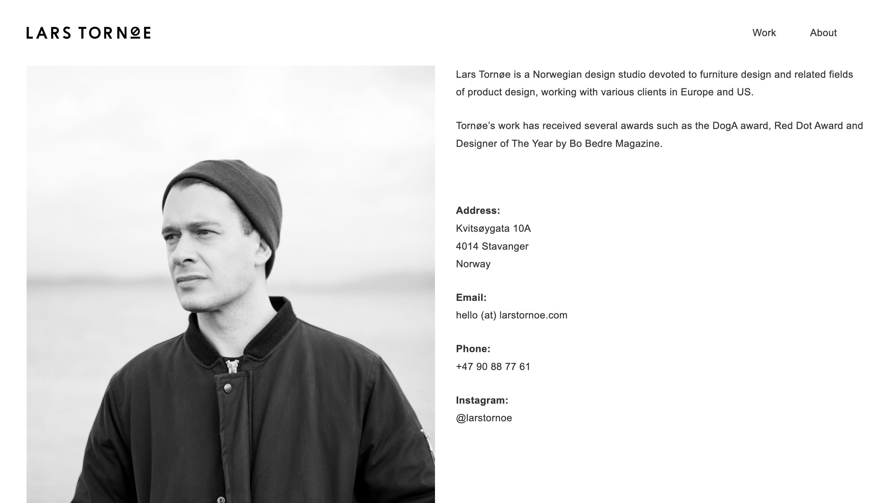

# Procesverslag
Markdown is een simpele manier om HTML te schrijven.  
Markdown cheat cheet: [Hulp bij het schrijven van Markdown](https://github.com/adam-p/markdown-here/wiki/Markdown-Cheatsheet).

Nb. De standaardstructuur en de spartaanse opmaak van de README.md zijn helemaal prima. Het gaat om de inhoud van je procesverslag. Besteedt de tijd voor pracht en praal aan je website.

Nb. Door *open* toe te voegen aan een *details* element kun je deze standaard open zetten. Fijn om dat steeds voor de relevante stuk(ken) te doen.

## Jij

  
uitwerken voor kick-off werkgroep

  ### Auteur:
  Sophie Mora

  #### Je startniveau:
  Blauw

  #### Je focus:
  Responsive
 

## Je website

  
uitwerken voor kick-off werkgroep

  ### Je opdracht:
  link naar de website die je gaat namaken óf de naam/omschrijving van je eigen ontwerp

  #### Screenshot(s) van de eerste pagina (small screen): 
  Home
  

  #### Screenshot(s) van de tweede pagina (small screen):
  About 
  
 

## Toegankelijkheidstest 1/2 (week 1)

  
uitwerken na test in 2e werkgroep

  ### Bevindingen
Best een antal errors, 90 namelijk. Ik had alleen geen light/dark mode dus daar wil ik me nog wel in verdiepen. 

## Breakdownschets (week 1)

  
uitwerken na afloop 3e werkgroep

  ### de hele pagina: 
  

## Voortgang 1 (week 2)

  
uitwerken voor 1e voortgang

  ### Stand van zaken
  Het ging best goed alleen ik merk dat ik gewoon snel vastloop en dan ook maar opgeef omdat ik het niet interessant vind. Ik heb nu wel een goede site eigenlijk alleen op mobiel formaat klopt hij niet meer. Dus hier moet ik nog het een en ander aan veranderen.

  ### Agenda voor meeting
  samen met je groepje opstellen

  | Sophie 1       | Rhania 2           | Amber 3      | Elles 4          |
  | ---            | ---                | ---          | ---              |
  | Flexbox en r   | flexbox            | moeite met t-| logo midden pla- |
  | esponsive      |                    | ekst en scha-| atsen schalen    |
  | ...            | ...                | len          | ...              |

  ### Verslag van meeting
  hier na afloop snel de uitkomsten van de meeting vastleggen

  - ik moet meer opdrachten doen en verdiepen in de stof. 
  - Ook kwam eruit dat we de volgende les aan mijn site moesten werken omdat de student assistenten niet goed konden zien waar het nou aan lag dat iets niet werkte

## Voortgang 2 (week 3)

  
uitwerken voor 2e voortgang

  ### Stand van zaken
  Eigenlijk is mijn site bijna af, dus het gaat super goed. Ik vind alleen een menu maken nog heel lastig. Hier moet ik dus een aantal vragen over stellen. 

  ### Agenda voor meeting
  samen met je groepje opstellen

  | Sophie 1       | Rhania 2           | Elles 3      | Amber 4          |
  | ---            | ---                | ---          | ---              |
  | Ik hoef niet   | en dit             | en ik dit    | en dan ik dat    |
  | echt te bespre | dit als er tijd is | nog een punt | dit wil ik zeker |
  | ken            | ...                | ...          | ...              |

  ### Verslag van meeting
  Het was best een chaotsiche en onhandige meeting omdat hij online was en we allemaal best veel moeite hadden met github en teams

  - Uitklapbaar menu maken en vormgeven
  - media query toevoegen om de site zo responsive mogelijk te maken
  - Focussen op de dark light mode en deze goed laten werken
- ...

## Toegankelijkheidstest 2/2 (week 4)

  
uitwerken na test in 9e werkgroep

  ### Bevindingen
  Eerst had mijn site 90 errors, en mijn 'namaak' heeft 0 erros (als het goed is). Ook had mijn site geen dark/light mode die heb ik er aan toegevoegd. Ook had ik nog niet al mijn images een alt tribute gegeven dus dat heb ik ook aangepast. 

  
  
  
  
  

## Voortgang 3 (week 4)

  
uitwerken voor 3e voortgang

  ### Stand van zaken
  Eigenlijk is mijn webiste zo goed als af. Hij is precies zoals ik hoopte en beter. 

  ### Agenda voor meeting
  samen met je groepje opstellen

  | Sophie 1       | Rhania 2           | Elles 3      | Amber 4          |
  | ---            | ---                | ---          | ---              |
  | puntjes op de  |                    | Responsive   | caption en trans-|
  | i zetten       | plaatjes           |              | cript            |
  | ...            | ...                | ...          | px en em         |

  ### Verslag van meeting
  hier na afloop snel de uitkomsten van de meeting vastleggen

  - ik moest toch nog voor mobiel een aantal aanpassingen maken, namelijk: tekst over de plaatjes aangezien je niet kunt tabben op telefoon. 
  - ook heb ik nog een extra form toegevoegd. 

## Eindgesprek (week 5)

  
uitwerken voor eindgesprek

  ### Je uitkomst - karakteristiek screenshots:
  
  
  
  
  
  
  
  

  ### Dit ging goed/Heb ik geleerd: 
  Korte omschrijving met plaatjes

  
  
  

  ### Dit was lastig/Is niet gelukt:
  Korte omschrijving met plaatjes

  

## Bronnenlijst

  
continu bijhouden terwijl je werkt

  Nb. Wees specifiek ('css-tricks' als bron is bijv. niet specifiek genoeg). 
  Nb. ChatGpT en andere AI horen er ook bij.
  Nb. Vermeld de bronnen ook in je code.

  1. Ik heb eigenlijk geen bronnen gebruikt. Alleen alles wat in de les werd besproken dus dan gewoon de powerpoints en oefeningen als bronnen.
  2. https://codepen.io/argyleink/pen/LYEegOO

